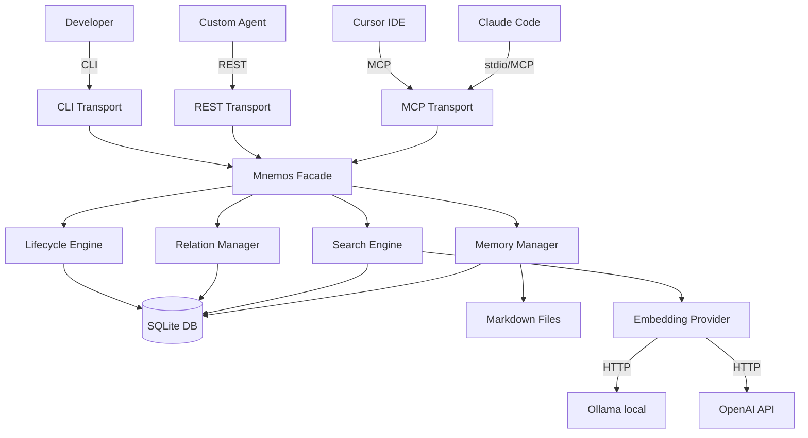
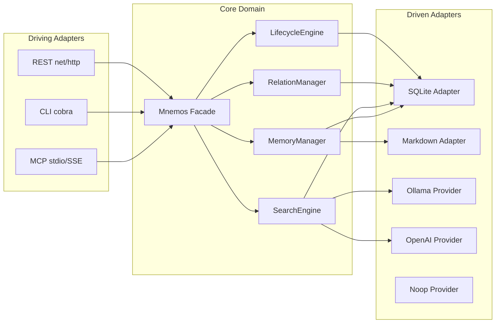
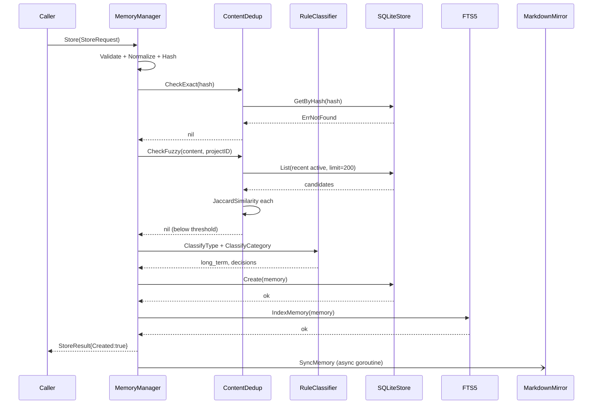
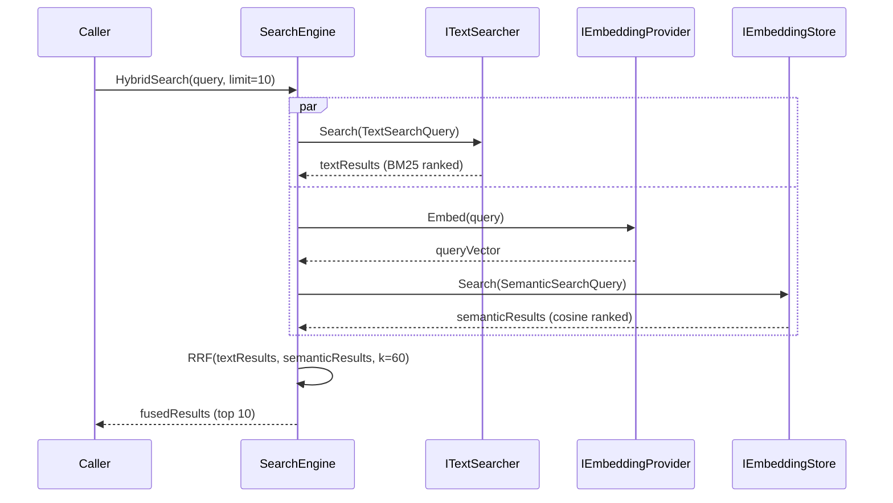

# Design Document: Mnemos Memory Engine

## Overview

Mnemos (Μνημος) là một unified memory engine cho AI coding agents, viết bằng Go, phân phối dưới dạng single binary (~15-20MB). Hệ thống giải quyết vấn đề mất context giữa các sessions bằng cách cung cấp persistent, searchable, và structured memory storage với MCP protocol support, CLI, và REST API.

Mnemos kế thừa điểm mạnh của claude-mem (MCP-native, human-readable markdown) và neutral-memory (semantic search, graph relations, lifecycle management), đồng thời loại bỏ điểm yếu của cả hai: không cần setup phức tạp, không có heavy dependencies, single binary zero-config.

Kiến trúc theo Hexagonal Architecture (Ports & Adapters): core domain hoàn toàn độc lập với transport layer và storage layer, cho phép swap bất kỳ component nào mà không ảnh hưởng đến business logic.

## Architecture

### System Context



### Hexagonal Architecture



## Project Structure

```
mnemos/
├── cmd/mnemos/main.go
├── internal/
│   ├── domain/
│   │   ├── memory.go          # Memory, StoreRequest, UpdateRequest, StoreResult
│   │   ├── relation.go        # MemoryRelation, GraphQuery, GraphResult, RelateRequest
│   │   ├── types.go           # MemoryType, MemoryStatus, RelationType, Trigger, Category
│   │   ├── errors.go          # ErrNotFound, ErrDuplicate, ErrValidation + typed errors
│   │   └── validation.go      # ValidateStoreRequest, ValidateUpdateRequest
│   ├── storage/
│   │   ├── interfaces.go      # IMemoryStore, ITextSearcher, IEmbeddingStore, IRelationStore, IMarkdownMirror
│   │   └── query.go           # ListQuery, TextSearchQuery, SemanticSearchQuery, SearchResult, Stats
│   ├── core/
│   │   ├── mnemos.go          # Facade: orchestrator, DI, background workers
│   │   ├── memory/
│   │   │   ├── manager.go     # MemoryManager CRUD
│   │   │   ├── options.go     # ManagerConfig + functional options
│   │   │   ├── classifier.go  # RuleClassifier
│   │   │   └── dedup.go       # ContentDedup 3-tier pipeline
│   │   ├── search/
│   │   │   ├── engine.go      # SearchEngine: text/semantic/hybrid/context
│   │   │   └── rrf.go         # Reciprocal Rank Fusion
│   │   ├── relation/
│   │   │   └── manager.go     # RelationManager: CRUD + graph traversal + auto-detect
│   │   └── lifecycle/
│   │       ├── engine.go      # LifecycleEngine: decay, archive, GC
│   │       └── decay.go       # Exponential decay formula
│   ├── storage/
│   │   ├── sqlite/
│   │   │   ├── store.go       # IMemoryStore + IRelationStore
│   │   │   ├── fts.go         # ITextSearcher (FTS5)
│   │   │   ├── embedding.go   # IEmbeddingStore (vector BLOB)
│   │   │   └── schema.go      # SQL schema + migrations
│   │   └── markdown/
│   │       └── mirror.go      # IMarkdownMirror
│   ├── embedding/
│   │   ├── provider.go        # IEmbeddingProvider interface
│   │   ├── ollama.go          # Ollama HTTP client
│   │   ├── openai.go          # OpenAI HTTP client
│   │   └── noop.go            # Noop (Level 0-1)
│   ├── transport/
│   │   ├── mcp/
│   │   │   ├── server.go      # MCP server setup (mark3labs/mcp-go)
│   │   │   ├── tools.go       # 8 MCP tools
│   │   │   ├── resources.go   # 2 MCP resources
│   │   │   └── prompts.go     # 2 MCP prompts
│   │   ├── rest/
│   │   │   ├── server.go      # net/http server
│   │   │   └── handlers.go    # HTTP handlers
│   │   └── cli/
│   │       ├── root.go        # Root cobra command
│   │       └── commands/      # init, serve, store, search, get, list, delete, relate, stats, maintain
│   ├── config/
│   │   └── config.go          # Config struct + viper loading
│   └── util/
│       ├── id.go              # ULID generation
│       ├── hash.go            # SHA-256 + NormalizeContent
│       ├── logger.go          # slog setup
│       └── timeutil.go        # NowUTC, time helpers
├── go.mod
├── Makefile
└── .goreleaser.yml
```

## Components and Interfaces

### Mnemos Facade

**Purpose**: Single entry point. Wires all engines, manages background workers, handles graceful shutdown.

```go
type IMnemosAPI interface {
    Store(ctx context.Context, req *domain.StoreRequest) (*domain.StoreResult, error)
    Get(ctx context.Context, id string) (*domain.Memory, error)
    Update(ctx context.Context, req *domain.UpdateRequest) (*domain.Memory, error)
    Delete(ctx context.Context, id string) error
    Search(ctx context.Context, req *SearchRequest) ([]storage.SearchResult, error)
    Relate(ctx context.Context, req *domain.RelateRequest) (*domain.MemoryRelation, error)
    Traverse(ctx context.Context, query domain.GraphQuery) (*domain.GraphResult, error)
    AssembleContext(ctx context.Context, req *ContextRequest) (*ContextResult, error)
    Maintain(ctx context.Context) (*MaintenanceResult, error)
    Stats(ctx context.Context) (*storage.Stats, error)
    Shutdown(ctx context.Context) error
}
```

### Memory Manager

**Purpose**: Orchestrates Store pipeline: validate → hash → dedup → classify → build → persist → index → mirror → embed(async).

```go
func (m *Manager) Store(ctx context.Context, req *domain.StoreRequest) (*domain.StoreResult, error)
func (m *Manager) Get(ctx context.Context, id string) (*domain.Memory, error)
func (m *Manager) List(ctx context.Context, query storage.ListQuery) ([]*domain.Memory, error)
func (m *Manager) Update(ctx context.Context, req *domain.UpdateRequest) (*domain.Memory, error)
func (m *Manager) Delete(ctx context.Context, id string) error
func (m *Manager) HardDelete(ctx context.Context, id string) error
func (m *Manager) Stats(ctx context.Context) (*storage.Stats, error)
```

### Search Engine

**Purpose**: Text search (FTS5/BM25), semantic search (cosine similarity), hybrid search (RRF), context assembly.

```go
func (e *Engine) TextSearch(ctx context.Context, q storage.TextSearchQuery) ([]storage.SearchResult, error)
func (e *Engine) SemanticSearch(ctx context.Context, text string, q storage.SemanticSearchQuery) ([]storage.SearchResult, error)
func (e *Engine) HybridSearch(ctx context.Context, req *HybridSearchRequest) ([]storage.SearchResult, error)
func (e *Engine) AssembleContext(ctx context.Context, req *ContextRequest) (*ContextResult, error)
```

### Relation Manager

**Purpose**: Directed memory graph: CRUD, BFS traversal, auto-detection of implicit relations.

```go
func (m *Manager) Relate(ctx context.Context, req *domain.RelateRequest) (*domain.MemoryRelation, error)
func (m *Manager) Unrelate(ctx context.Context, id string) error
func (m *Manager) Traverse(ctx context.Context, query domain.GraphQuery) (*domain.GraphResult, error)
func (m *Manager) AutoDetect(ctx context.Context, memory *domain.Memory) ([]*domain.MemoryRelation, error)
```

### Lifecycle Engine

**Purpose**: Background decay, archival, GC. Runs on configurable ticker (default 24h).

```go
func (e *Engine) RunDecay(ctx context.Context) (*DecayResult, error)
func (e *Engine) RunArchival(ctx context.Context) (*ArchivalResult, error)
func (e *Engine) RunGC(ctx context.Context) (*GCResult, error)
func (e *Engine) Start(ctx context.Context) error
func (e *Engine) Stop() error
```

## Data Models

### Memory struct

```go
type Memory struct {
    ID             string       // ULID — sortable, unique
    Content        string       // Main text, indexed for FTS5
    Summary        *string      // Optional summary
    Type           MemoryType   // short_term | long_term | episodic | semantic
    Category       string       // 13 built-in categories, extensible
    Tags           []string     // Free-form labels, max 50
    Source         MemorySource // {Agent, SessionID, Trigger}
    ProjectID      *string      // nil = global
    CreatedAt      time.Time
    UpdatedAt      time.Time
    LastAccessedAt time.Time
    AccessCount    int
    RelevanceScore float64      // [0.0, 1.0], managed by LifecycleEngine
    Status         MemoryStatus // active | archived | deleted
    ContentHash    string       // SHA-256 of normalized content
}
```

### SQLite Schema

```sql
CREATE TABLE memories (
    id               TEXT PRIMARY KEY,
    content          TEXT NOT NULL,
    summary          TEXT,
    type             TEXT NOT NULL DEFAULT 'short_term',
    category         TEXT NOT NULL DEFAULT 'general',
    tags             TEXT NOT NULL DEFAULT '[]',
    source_agent     TEXT NOT NULL DEFAULT 'unknown',
    source_session   TEXT,
    source_trigger   TEXT NOT NULL DEFAULT 'manual',
    project_id       TEXT,
    created_at       INTEGER NOT NULL,
    updated_at       INTEGER NOT NULL,
    last_accessed_at INTEGER NOT NULL,
    access_count     INTEGER NOT NULL DEFAULT 0,
    relevance_score  REAL NOT NULL DEFAULT 1.0,
    status           TEXT NOT NULL DEFAULT 'active',
    content_hash     TEXT NOT NULL UNIQUE
);

CREATE VIRTUAL TABLE memories_fts USING fts5(
    id UNINDEXED, content, summary, tags, category,
    content='memories', content_rowid='rowid'
);

CREATE TABLE memory_relations (
    id            TEXT PRIMARY KEY,
    source_id     TEXT NOT NULL REFERENCES memories(id),
    target_id     TEXT NOT NULL REFERENCES memories(id),
    relation_type TEXT NOT NULL,
    strength      REAL NOT NULL DEFAULT 0.8,
    metadata      TEXT DEFAULT '{}',
    created_at    INTEGER NOT NULL,
    UNIQUE(source_id, target_id, relation_type)
);

CREATE TABLE memory_embeddings (
    memory_id  TEXT PRIMARY KEY REFERENCES memories(id) ON DELETE CASCADE,
    vector     BLOB NOT NULL,
    dimensions INTEGER NOT NULL,
    model      TEXT NOT NULL,
    created_at INTEGER NOT NULL
);
```

## Sequence Diagrams

### Store Memory



### Hybrid Search



## Algorithmic Pseudocode

### Store Pipeline

```pascal
ALGORITHM Store(req)
INPUT: req of type StoreRequest
OUTPUT: result of type StoreResult

BEGIN
  ASSERT ValidateStoreRequest(req) = nil

  content ← TrimSpace(req.Content)
  hash    ← SHA256(Normalize(content))

  // Tier 1: Exact dedup
  existing ← store.GetByHash(hash)
  IF existing != nil AND existing.Status = active THEN
    existing.TouchAccess()
    store.Update(existing)
    RETURN StoreResult{Memory: existing, Created: false, DedupScore: 1.0}
  END IF

  // Tier 2: Fuzzy dedup
  candidates ← store.List(active, limit=200)
  FOR each candidate IN candidates DO
    score ← JaccardSimilarity(TokenSet(content), TokenSet(candidate.Content))
    IF score >= config.FuzzyThreshold THEN
      merged ← MergeContent(candidate, content)
      store.Update(merged)
      RETURN StoreResult{Memory: merged, Created: false, DedupScore: score}
    END IF
  END FOR

  // Classify
  memType  ← IF req.Type != "" THEN ParseType(req.Type) ELSE classifier.ClassifyType(content, tags)
  category ← IF req.Category != "" THEN req.Category ELSE classifier.ClassifyCategory(content, tags)

  // Build + Persist
  memory ← Memory{ID: NewULID(), Content: content, Type: memType, ...}
  store.Create(memory)
  fts.IndexMemory(memory)

  // Async
  GO mirror.SyncMemory(memory)
  GO embedQueue.Enqueue(memory.ID)

  RETURN StoreResult{Memory: memory, Created: true}
END
```

### Decay Formula

```pascal
ALGORITHM ComputeDecayScore(memory, now)
INPUT: memory of type Memory, now of type Time
OUTPUT: score of type float64

BEGIN
  t             ← HoursSince(memory.LastAccessedAt, now)
  lambda        ← memory.Type.DefaultDecayRate()
  accessBoost   ← 1.0 + log(1 + memory.AccessCount) * 0.1
  typeMultiplier ← TypeMultiplier(memory.Type)
  floor         ← 0.05

  score ← memory.RelevanceScore * exp(-lambda * t) * accessBoost * typeMultiplier
  score ← max(floor, min(1.0, score))

  ASSERT score >= floor
  ASSERT score <= memory.RelevanceScore  // decay never increases

  RETURN score
END
```

### Reciprocal Rank Fusion

```pascal
ALGORITHM ReciprocRankFusion(textResults, semanticResults, k)
INPUT: textResults, semanticResults of type []SearchResult, k of type float64
OUTPUT: fused of type []SearchResult

BEGIN
  scores ← empty map[memoryID → float64]

  FOR rank, result IN enumerate(textResults) DO
    scores[result.Memory.ID] += 1.0 / (k + rank + 1)
  END FOR

  FOR rank, result IN enumerate(semanticResults) DO
    scores[result.Memory.ID] += 1.0 / (k + rank + 1)
  END FOR

  fused ← []SearchResult
  FOR id, score IN scores DO
    memory ← hydrateMemory(id)
    fused.append(SearchResult{Memory: memory, HybridScore: score})
  END FOR

  SORT fused BY HybridScore DESCENDING

  RETURN fused
END
```

## MCP Tools Specification

| Tool | Description | Required Params |
|------|-------------|-----------------|
| `mnemos_store` | Store a new memory | `content` |
| `mnemos_search` | Search (text/semantic/hybrid) | `query` |
| `mnemos_get` | Get memory by ID | `id` |
| `mnemos_update` | Update existing memory | `id` |
| `mnemos_delete` | Soft-delete a memory | `id` |
| `mnemos_relate` | Create relation between memories | `source_id`, `target_id`, `relation_type` |
| `mnemos_context` | Assemble context for a topic | `query` |
| `mnemos_maintain` | Run lifecycle maintenance | — |

**Resources**: `mnemos://memories/{project_id}`, `mnemos://stats`

**Prompts**: `load_context` (session start), `save_session` (session end)

## Error Handling

| Scenario | Error | Response | Recovery |
|----------|-------|----------|----------|
| Duplicate content | `ErrDuplicate` | Return existing memory, `Created: false` | Inspect `DedupScore` |
| Storage unavailable | `ErrStorageUnavailable` | Log + return error | Retry with backoff |
| Embedding offline | `ErrEmbeddingUnavailable` | Degrade to text-only search | Queue for retry |
| Validation failure | `ValidationErrors` | Per-field error details | Fix input, retry |
| Memory not found | `ErrNotFound` | 404-equivalent | Check ID |

## Testing Strategy

### Unit Testing

Each engine tested in isolation with mock storage interfaces using `testify/mock`.

### Property-Based Testing

**Library**: `pgregory.net/rapid`

Key properties:
- `Store(x); Get(id) == x` — round-trip consistency
- `Store(x); Store(x) → Created: false` — exact dedup idempotency
- `JaccardSimilarity(A, A) == 1.0` — reflexivity
- `JaccardSimilarity(A, B) == JaccardSimilarity(B, A)` — symmetry
- `CosineSimilarity(v, v) == 1.0` — vector reflexivity
- `DecayScore(m, t2) <= DecayScore(m, t1)` when `t2 > t1` — monotonic decay

### Integration Testing

Real SQLite in-memory DB (`file::memory:?cache=shared`):
- Full Store → Search → Get round-trip
- MCP tool invocation via stdio
- Lifecycle decay + archival pipeline
- Markdown mirror sync

## Performance Considerations

| Operation | Target | Approach |
|-----------|--------|----------|
| MCP startup | < 50ms | Lazy SQLite init |
| Memory store | < 50ms | Sync SQLite + FTS5 write |
| Text search (10K) | < 100ms | FTS5 BM25 + WAL mode |
| Semantic search (10K) | < 500ms | Brute-force cosine |
| Hybrid search | < 600ms | Parallel text + semantic |
| Decay batch (1K) | < 1s | BulkUpdateRelevance single tx |
| Binary size | ~15-20MB | Pure Go, minimal deps |
| Idle memory | < 30MB | WAL mode, no in-memory cache |

SQLite pragmas: `journal_mode=WAL`, `synchronous=NORMAL`, `cache_size=-64000`, `foreign_keys=ON`.

## Security Considerations

- MCP runs over stdio by default — no open ports
- Project scoping prevents cross-project data leakage
- SQLite file created with 0600 permissions
- Config file (with API keys) created with 0600 permissions
- All inputs validated; content capped at 100KB
- No secrets stored in SQLite or markdown files

## Dependencies

| Package | Purpose |
|---------|---------|
| `modernc.org/sqlite` | Pure Go SQLite, FTS5, WAL — zero CGO |
| `github.com/mark3labs/mcp-go` | MCP protocol server |
| `github.com/spf13/cobra` | CLI framework |
| `github.com/spf13/viper` | Config management |
| `github.com/oklog/ulid/v2` | Sortable unique IDs |
| `github.com/stretchr/testify` | Test assertions + mocking |
| `pgregory.net/rapid` | Property-based testing |
| `log/slog` (stdlib) | Structured logging |
| `net/http` (stdlib) | REST server + embedding HTTP clients |
| `crypto/sha256` (stdlib) | Content hashing |
